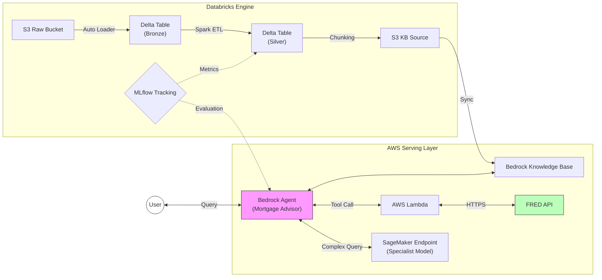
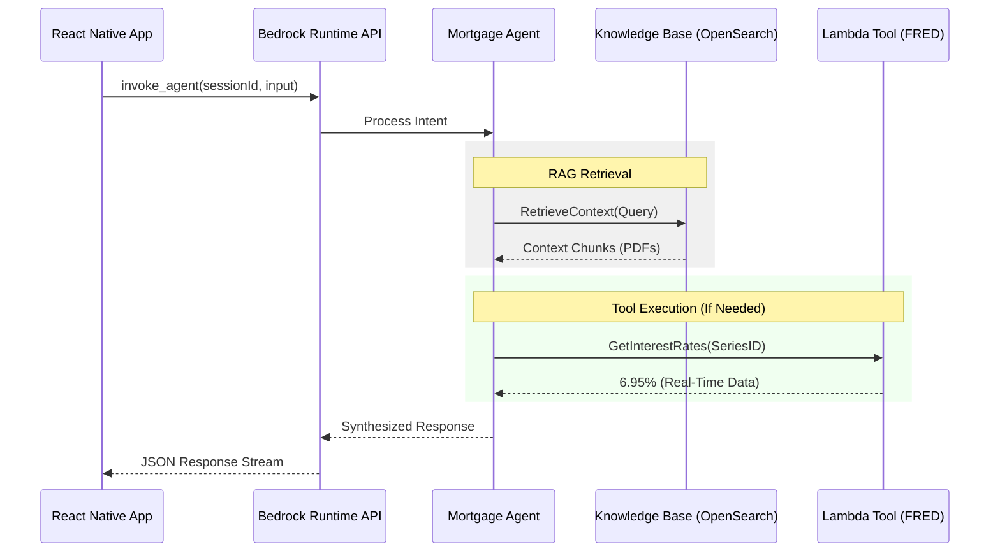

# Mortgage Xpert: Unified GenAI MLOps Platform

**An Enterprise-Grade RAG System deployed via Terraform on AWS & Databricks.**

## System Overview
This project implements a **Mortgage Underwriting Copilot**, a sophisticated AI system capable of navigating complex regulatory frameworks (e.g., Freddie Mac/Fannie Mae selling guidelines) with high precision.

### Architectural Evolution
This platform represents a significant architectural upgrade from a standard Multi-Agent Amazon Bedrock implementation. By integrating **Databricks**, the system transitions from a basic retrieval chatbot to a robust **MLOps Platform** featuring:
1.  **Industrial Data Engineering**: Replacing ad-hoc S3 uploads with Databricks Auto Loader for scalable, reliable PDF ingestion.
2.  **Governed Knowledge**: Utilizing Databricks Unity Catalog and Delta Lake to ensure data quality and lineage before it reaches the vector store.
3.  **Advanced Evaluation**: Implementing MLflow to systematically benchmark agent performance against "Golden Datasets," moving beyond manual testing.
4.  **Hybrid Intelligence**: Orchestrating a synergy between AWS Bedrock Agents (Logic/Retrieval) and SageMaker endpoints (Specialized Inference).

## Scalable Infrastructure (Main Module Approach)
The infrastructure is provisioned using the **Terraform Main Module** pattern. This strictly separates environment configuration from resource logic, ensuring:
*   **Identical Environments**: Development, Staging, and Production environments share the exact same codebase, eliminating configuration drift.
*   **Atomic Updates**: Changes to the core "Umbrella" module propagate consistently across all environments.
*   **Simplified State Management**: Each environment maintains an isolated state file backend.

---

## Architecture Diagrams

### 1. System Architecture
The following diagram illustrates the data flow and component integration across AWS and Databricks.



### 2. HTTP Communication Flow
The detailed request/response lifecycle for the React Native application integration.



---

## Technology Stack

| Component | Technology | Primary Function |
| :--- | :--- | :--- |
| **IaC** | **Terraform** | Infrastructure orchestration for AWS & Databricks resources. |
| **Data Eng** | **Databricks (Spark)** | Scalable ingestion (Auto Loader) and transformation (Delta Lake). |
| **GenAI** | **AWS Bedrock** | Agentic orchestration and Knowledge Base (OpenSearch Serverless). |
| **Inference** | **Amazon SageMaker** | Hosting specialized custom models for edge-case reasoning. |
| **MLOps** | **MLflow** | Experiment tracking, model registry, and agent evaluation. |
| **Integration** | **AWS Lambda** | Serverless connectivity for external APIs (FRED). |

## Repository Structure
```text
terraform_project/
├── env/
│   └── dev01/              # Production Environment Configuration
├── main/                   # Umbrella Module (Core Architecture)
└── modules/                
    ├── 01_networking/      # VPC, Multi-AZ Networking
    ├── 02_storage/         # S3 Buckets, IAM Policies
    ├── 03_databricks/      # workspace, Clusters, Jobs
    ├── 04_bedrock/         # Agents, Action Groups, KB
    └── 05_sagemaker/       # Custom Inference Endpoints
```
