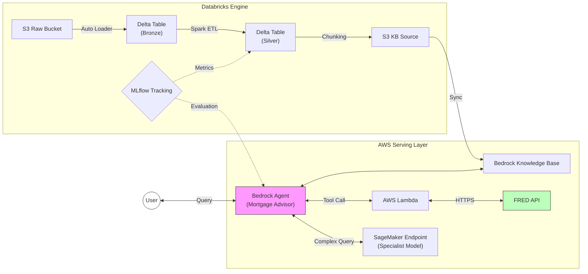
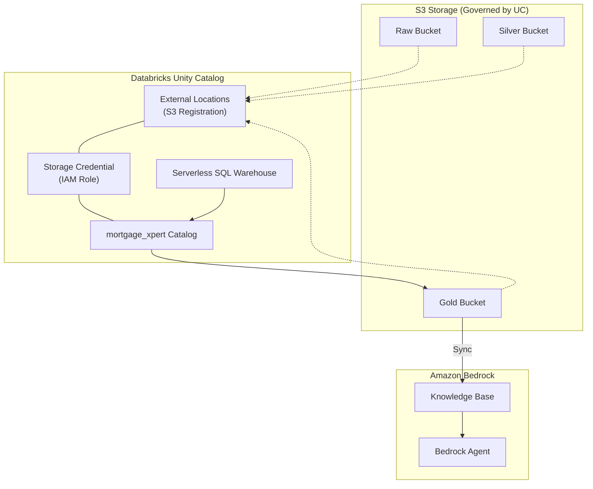

# Mortgage Xpert

A unified GenAI MLOps platform using Databricks and AWS Bedrock to power an AI Mortgage Advisor for iOS and Android.

## Table of Contents
1. [System Overview](#system-overview)
2. [Architectural Evolution](#architectural-evolution)
3. [Databricks Modern Integration](#databricks-modern-integration)
4. [Scalable Infrastructure (Main Module Approach)](#scalable-infrastructure-main-module-approach)
5. [Deployment Verification](#deployment-verification)
6. [Technology Stack](#technology-stack)

---

## System Overview

An enterprise-grade RAG architecture deployed on AWS and Databricks using Terraform for infrastructure provisioning.

### System Architecture
The following diagram illustrates the data flow and component integration across AWS and Databricks.



### Architectural Evolution
This platform represents a significant architectural upgrade from a standard Multi-Agent implementation. By integrating Databricks, the system transitions from a basic retrieval chatbot to a robust MLOps Platform featuring:

1.  **Industrial Data Engineering**: Replacing ad-hoc S3 uploads with Databricks Auto Loader for scalable, reliable PDF ingestion.
2.  **Modern Data Governance**: Utilizing Databricks Unity Catalog to provide enterprise-grade data security, lineage, and discovery across all S3 storage.
3.  **Serverless First**: Leveraging Serverless SQL Warehouses and Serverless Notebooks to eliminate the overhead of managing EC2 clusters.
4.  **Advanced Evaluation**: Implementing MLflow to systematically benchmark agent performance against Golden Datasets.

---

## Databricks Modern Integration

The platform utilizes a **Unity Catalog** and **Serverless** architecture to bypass legacy EC2 cluster limitations and provide enterprise-ready governance.

### Credentials Setup
To run the Terraform deployment, the following variables must be configured in `env/dev/locals.tf`:

- **databricks_host**: The Workspace URL (e.g., `https://adb-xxxx.cloud.databricks.com`).
- **databricks_token**: A Personal Access Token generated via **User Settings** -> **Developer** -> **Access tokens**.

### Unity Catalog Data Flow
The dynamic relationship between S3 storage, Unity Catalog governance, and Bedrock serving.



### Managed Resources
The `modules/databricks` layer provisions the following objects:

| Resource | Scope | Purpose |
| :--- | :--- | :--- |
| **Storage Credential** | Global | Links AWS IAM Roles to Unity Catalog. |
| **External Locations**| Workspace | Registers S3 buckets as secure, accessible storage paths. |
| **Catalog** | Global | The top-level container (`mortgage_xpert`) for platform data. |
| **Schemas** | Catalog | Organizes data into bronze, silver, and gold layers. |
| **SQL Warehouse** | Workspace | Serverless compute for all data engineering and AI queries. |

---

## Scalable Infrastructure (Main Module Approach)

The infrastructure is provisioned using the **Terraform Main Module** pattern. This strictly separates environment configuration from resource logic, ensuring:
*   **Identical Environments**: Development, Staging, and Production environments share the exact same codebase, eliminating configuration drift.
*   **Atomic Updates**: Changes to the core "Umbrella" module propagate consistently across all environments.
*   **Simplified State Management**: Each environment maintains an isolated state file backend.

### Architecture: Facts vs. Wiring
The design separates static configuration from automated resource composition.

1. **Environment Data (locals.tf)**: Defines "Facts" that only the environment knows (VPC CIDR, Subnet map, AZs, and Public/Private status).
2. **Orchestration Logic (infrastructure/main.tf)**: Functions as the "Wiring." It automatically calculates dependencies on the fly, eliminating redundant manual configuration.

#### Automated Derived Logic
The orchestrator dynamically calculates the following:

- **Gateways**: Instead of manual mapping, the system automatically provisions a NAT Gateway for every public subnet.
```hcl
nat_gateway_config = {
  for k, v in each.value.subnets : k => module.subnets[each.key].subnet_ids[k] 
  if v.public
}
```

- **AZ-Aware Routing**: Private subnets are automatically mapped to the NAT Gateway residing in their same Availability Zone.
```hcl
nat_gateway_id = [
  for pk, pv in each.value.subnets : pk 
  if pv.public && pv.availability_zone == v.availability_zone
][0]
```

### Deployment Workflow
Use the -chdir option to manage environments from the root directory:

```bash
# Initialize
terraform -chdir=env/dev init

# Apply
terraform -chdir=env/dev apply
```

### Project Structure

```text
.
├── env/
│   ├── dev/
│   ├── staging/
│   └── prod/
├── infrastructure/
├── modules/
│   ├── networking/
│   │   ├── gateways/
│   │   ├── routing/
│   │   ├── subnets/
│   │   └── vpc/
│   ├── databricks/
│   ├── iam/
│   └── storage/
└── scripts/
```

---

## Deployment Verification

The networking infrastructure is verified through live AWS metadata inspection to ensure correct traffic routing.

### 1. Private-to-NAT Routing
Verify that the private subnet is correctly directed to the NAT Gateway:
```bash
aws ec2 describe-route-tables \
  --filters "Name=association.subnet-id,Values=[PRIVATE_SUBNET_ID]" \
  --query 'RouteTables[0].Routes[?DestinationCidrBlock==`0.0.0.0/0`]'
```

### 2. Public-to-Internet Routing
Verify that the NAT Gateway resides in a subnet with a path to the Internet Gateway:
```bash
aws ec2 describe-route-tables \
  --filters "Name=association.subnet-id,Values=[PUBLIC_SUBNET_ID]" \
  --query 'RouteTables[0].Routes[?DestinationCidrBlock==`0.0.0.0/0`]'
```

---

## Technology Stack

| Component | Technology | Primary Function |
| :--- | :--- | :--- |
| **IaC** | **Terraform** | Infrastructure orchestration for AWS & Databricks resources. |
| **Governance**| **Unity Catalog** | Centralized access control and discovery for all data assets. |
| **Compute** | **Serverless SQL** | Dedicated serverless endpoints for data engineering and AI queries. |
| **GenAI** | **AWS Bedrock** | Agentic orchestration and Knowledge Base (OpenSearch Serverless). |
| **MLOps** | **MLflow** | Experiment tracking, model registry, and agent evaluation. |
| **Integration** | **AWS Lambda** | Serverless connectivity for external APIs (FRED). |
