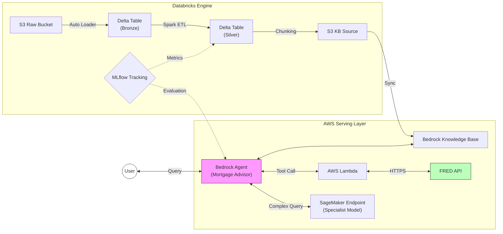
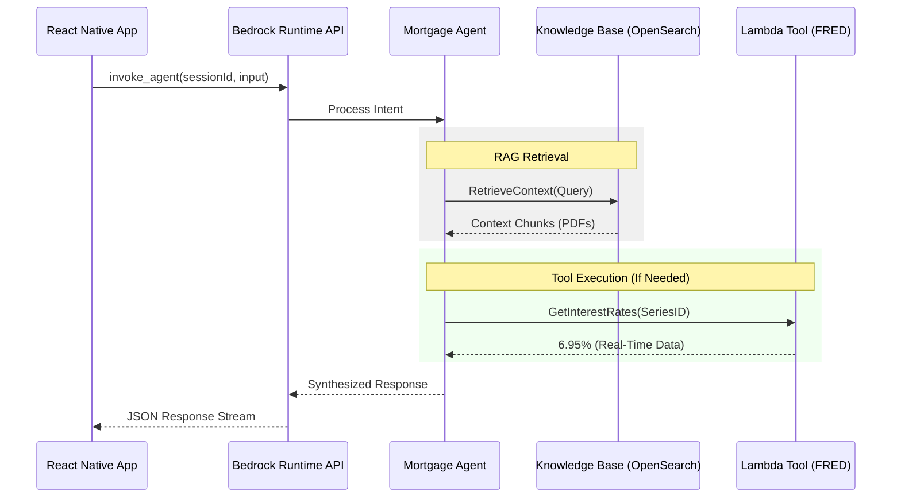

# Mortgage Xpert

A unified GenAI MLOps platform using Databricks and AWS Bedrock to power an AI Mortgage Advisor for iOS and Android.

## System Overview

An enterprise-grade RAG architecture deployed on AWS and Databricks using Terraform for infrastructure provisioning.


### 1. System Architecture
The following diagram illustrates the data flow and component integration across AWS and Databricks.



### Architectural Evolution
This platform represents a significant architectural upgrade from a standard Multi-Agent Amazon Bedrock implementation. By integrating Databricks, the system transitions from a basic retrieval chatbot to a robust MLOps Platform featuring:

1.  **Industrial Data Engineering**: Replacing ad-hoc S3 uploads with Databricks Auto Loader for scalable, reliable PDF ingestion.

2.  **Governed Knowledge**: Utilizing Databricks Unity Catalog and Delta Lake to ensure data quality and lineage before it reaches the vector store.

3.  **Advanced Evaluation**: Implementing MLflow to systematically benchmark agent performance against Golden Datasets, moving beyond manual testing.

4.  **Hybrid Intelligence**: Orchestrating a synergy between AWS Bedrock Agents (Logic/Retrieval) and SageMaker endpoints (Specialized Inference).

---

### 2. HTTP Communication Flow
The detailed request/response lifecycle for the React Native application integration.



---

## Scalable Infrastructure (Main Module Approach)
The infrastructure is provisioned using the **Terraform Main Module** pattern. This strictly separates environment configuration from resource logic, ensuring:
*   **Identical Environments**: Development, Staging, and Production environments share the exact same codebase, eliminating configuration drift.
*   **Atomic Updates**: Changes to the core "Umbrella" module propagate consistently across all environments.
*   **Simplified State Management**: Each environment maintains an isolated state file backend.

### Execution & Environment Management

This project utilizes a map-driven Multi-VPC orchestration pattern.

#### Architecture: Facts vs. Wiring
The design separates static configuration from automated resource composition.

1. **Environment Data (locals.tf)**: Defines "Facts" that only the environment knows (VPC CIDR, Subnet map, AZs, and Public/Private status).
2. **Orchestration Logic (infrastructure/main.tf)**: Functions as the "Wiring." It automatically calculates dependencies on the fly, eliminating redundant manual configuration.

##### Automated Derived Logic
The orchestrator dynamically calculates the following:

- **Gateways**: Instead of manual mapping, the system automatically provisions a NAT Gateway for every public subnet.
```hcl
nat_gateway_config = {
  for k, v in each.value.subnets : k => module.subnets[each.key].subnet_ids[k] 
  if v.public
}
```

- **AZ-Aware Routing**: Private subnets are automatically mapped to the NAT Gateway residing in their same Availability Zone.
```hcl
nat_gateway_id = [
  for pk, pv in each.value.subnets : pk 
  if pv.public && pv.availability_zone == v.availability_zone
][0]
```

This approach allows for horizontal AZ scaling by updating only the `locals.tf` data.

#### Deployment Workflow
Use the `-chdir` option to manage environments from the root directory:

```bash
# Initialize
terraform -chdir=env/dev init

# Plan and Apply
terraform -chdir=env/dev plan
terraform -chdir=env/dev apply
```

#### Project Structure

```text
.
├── env/
│   ├── dev/
│   ├── staging/
│   └── prod/
├── infrastructure/
├── modules/
│   └── networking/
│       ├── gateways/
│       ├── routing/
│       ├── subnets/
│       └── vpc/
└── scripts/
```

#### Deployment Verification
The networking infrastructure is verified through live AWS metadata inspection to ensure correct traffic routing.

**1. Private-to-NAT Routing**
Verify that the private subnet is correctly directed to the NAT Gateway:
```bash
aws ec2 describe-route-tables \
  --filters "Name=association.subnet-id,Values=[PRIVATE_SUBNET_ID]" \
  --query 'RouteTables[0].Routes[?DestinationCidrBlock==`0.0.0.0/0`]'
```
*Expected Output:*
```json
[
    {
        "DestinationCidrBlock": "0.0.0.0/0",
        "NatGatewayId": "nat-[...]",
        "State": "active"
    }
]
```

**2. Public-to-Internet Routing**
Verify that the NAT Gateway resides in a subnet with a path to the Internet Gateway:
```bash
aws ec2 describe-route-tables \
  --filters "Name=association.subnet-id,Values=[PUBLIC_SUBNET_ID]" \
  --query 'RouteTables[0].Routes[?DestinationCidrBlock==`0.0.0.0/0`]'
```
*Expected Output:*
```json
[
    {
        "DestinationCidrBlock": "0.0.0.0/0",
        "GatewayId": "igw-[...]",
        "State": "active"
    }
]
```

## Technology Stack

| Component | Technology | Primary Function |
| :--- | :--- | :--- |
| **IaC** | **Terraform** | Infrastructure orchestration for AWS & Databricks resources. |
| **Data Eng** | **Databricks (Spark)** | Scalable ingestion (Auto Loader) and transformation (Delta Lake). |
| **GenAI** | **AWS Bedrock** | Agentic orchestration and Knowledge Base (OpenSearch Serverless). |
| **Inference** | **Amazon SageMaker** | Hosting specialized custom models for edge-case reasoning. |
| **MLOps** | **MLflow** | Experiment tracking, model registry, and agent evaluation. |
| **Integration** | **AWS Lambda** | Serverless connectivity for external APIs (FRED). |
