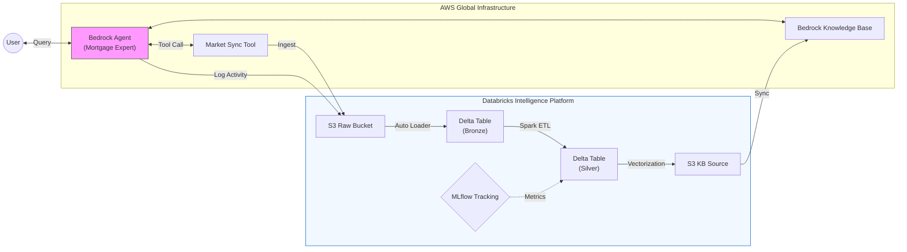

# Mortgage Xpert: Databricks-Native AI Infrastructure

A high-performance GenAI platform that leverages **Databricks** for industrial data engineering and **AWS Bedrock** for authoritative agentic orchestration. 

This platform transforms an AI Mortgage Advisor into a governed data asset, where every interaction and market update is land-locked into the Databricks Lakehouse.

## Table of Contents
1. [Databricks-First Strategy](#databricks-first-strategy)
2. [Modern Data Stack Architecture](#modern-data-stack-architecture)
3. [Conversational Analytics (Databricks Ingestion)](#conversational-analytics-databricks-ingestion)
4. [Enterprise RAG & Agency](#enterprise-rag--agency)
5. [Scalable IaC Infrastructure](#scalable-iac-infrastructure)
6. [Deployment & Verification](#deployment-verification)

---

## Databricks-First Strategy

This platform moves beyond simple chatbots by treating the AI as an active participant in the **Databricks Modern Data Stack**.

*   **Industrial Data Engineering**: Uses Databricks Auto Loader to ingest mortgage guidelines and market rates.
*   **Conversational Audit Trail**: Every user query and AI response is streamed directly into the Databricks **Bronze Layer** via S3.
*   **Unity Catalog Governance**: Provides centralized access control, lineage, and discovery across all MLOps assets.
*   **Serverless Efficiency**: Powered by Serverless SQL Warehouses and Notebook endpoints for zero-admin compute.

---

## Modern Data Stack Architecture

The following diagram illustrates the symbiotic relationship between **Databricks** (the Data Intelligence Platform) and **AWS** (the Execution Layer).



---

## Conversational Analytics (Databricks Ingestion)

The platform implements a continuous feedback loop where all AI activity is land-locked for analysis.

### Querying Chat Logs in Databricks SQL
You can monitor user behavior and AI performance directly from your SQL Warehouse:

```sql
-- View all bot activity from the Bronze layer
SELECT 
  timestamp::timestamp as event_time,
  userMessage as question,
  botResponse as answer,
  citations
FROM json.`s3://[YOUR-RAW-BUCKET]/chat_logs/*/*.json`
ORDER BY event_time DESC;
```

### Real-Time Data Lake Sync
Users can trigger an immediate re-population of the data lake via the AI agent:
- **Prompt**: *"Perform a full sync of all mortgage indices to our data lake."*
- **Action**: The Agent invokes the `FRED` sync tool, fetching 30yr/15yr/ARM rates and landing them as fresh JSON assets in the `raw/mortgage_rates/` prefix.

---

## Enterprise RAG & Agency

The **Mortgage Xpert** agent is configured as an authoritative internal specialist.

1.  **Authoritative Persona**: Unlike generic LLMs, this agent is instructed to speak as the firm's expert, utilizing internal Knowledge Bases as the definitive source of truth.
2.  **Rich Citations**: Responses include `[number]` markers that link directly to internal PDF guidelines stored in S3 and managed by Databricks.
3.  **Tool-Augmented Intelligence**: Leverages AWS Lambda to bridge the gap between static guidelines and live financial APIs.

---

## Scalable IaC Infrastructure

The infrastructure follows the **Terraform Main Module** pattern, ensuring strict separation between environment facts and resource logic.

### Managed Databricks Resources
The `modules/databricks` layer provisions:
- **Unity Catalog Storage Credentials**: Links AWS IAM Roles to UC.
- **External Locations**: Securely registers S3 buckets as governed storage.
- **Metastore Catalogs & Schemas**: Organizes the `mortgage_xpert` data hierarchy.
- **Serverless SQL Warehouse**: Provides compute for data engineering and BI.

---

## Deployment & Verification

### Deployment Workflow
Initialize and apply from the `env/` directory:

```bash
terraform -chdir=env/dev init
terraform -chdir=env/dev apply
```

### Verification CLI
Verify the private-to-NAT routing to ensure secure Lambda-to-Data-Lake communication:
```bash
aws ec2 describe-route-tables \
  --filters "Name=association.subnet-id,Values=[PRIVATE_SUBNET_ID]" \
  --query 'RouteTables[0].Routes[?DestinationCidrBlock==`0.0.0.0/0`]'
```

---

## Technology Stack

| Component | Technology | Primary Function |
| :--- | :--- | :--- |
| **Data Platform** | **Databricks** | Lakehouse governance, Auto Loader, and AI Analytics. |
| **GenAI Engine** | **AWS Bedrock** | Authoritative Agent (Claude 3 Haiku) & RAG Knowledge Base. |
| **IaC** | **Terraform** | Multi-provider orchestration for AWS & Databricks. |
| **Governance** | **Unity Catalog** | Centralized access control for S3 and Delta tables. |
| **Integrations** | **AWS Lambda** | Real-time market data ingestion and tool execution. |
| **Evaluation** | **MLflow** | Systematic tracking of Agent and Model metrics. |
