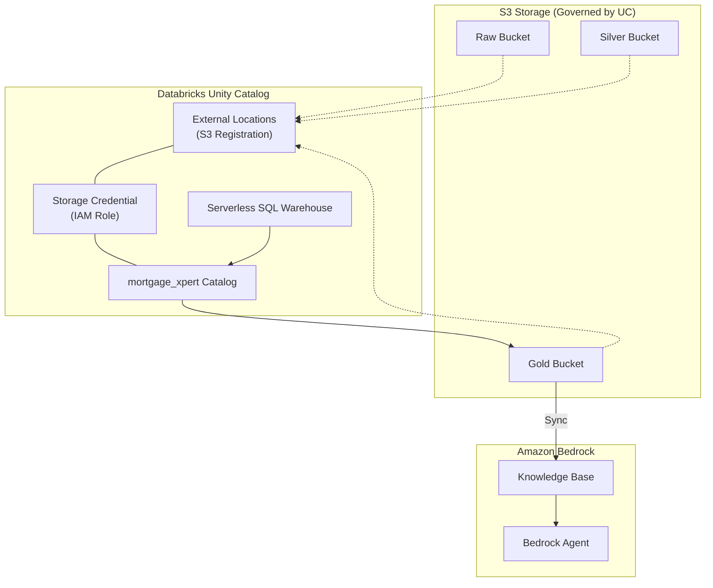
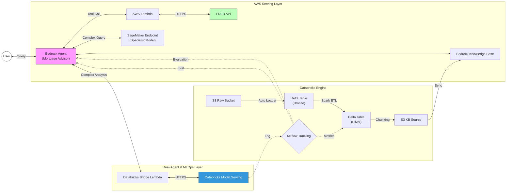

# Mortgage Xpert: Databricks-Native AI Infrastructure

A high-performance GenAI platform that leverages **Databricks** for industrial data engineering and **AWS Bedrock** for authoritative agentic orchestration. 

This platform transforms an AI Mortgage Advisor into a governed data asset, where every interaction and market update is land-locked into the Databricks Lakehouse.

A detailed explanation and development process can be found [here](https://zircon-lip-5ec.notion.site/Mortgage-Xpert-2e0266e0cc2380a39552f1956910b999)

## Table of Contents
1. [Prerequisites](#prerequisites)
2. [Databricks Modern Integration](#databricks-modern-integration)
3. [Conversational Analytics & Data Lake Sync](#conversational-analytics--data-lake-sync)
4. [System Overview](#system-overview)
5. [Architectural Evolution](#architectural-evolution)
6. [Scalable Infrastructure (Main Module Approach)](#scalable-infrastructure-main-module-approach)
7. [Deployment Verification](#deployment-verification)
8. [Technology Stack](#technology-stack)

---

## Prerequisites

To deploy and run this platform, you will need:
- **AWS Account**: With sufficient permissions to manage Bedrock, OpenSearch Serverless, Lambda, and IAM.
- **Databricks Account**: A standard or trial workspace. You can sign up for a **Databricks Free Trial** which provides 14 days of full platform access.

---

## Databricks Modern Integration

The platform utilizes a **Unity Catalog** and **Serverless** architecture to bypass legacy EC2 cluster limitations and provide enterprise-ready governance.

### Unity Catalog Data Flow
The dynamic relationship between S3 storage, Unity Catalog governance, and Bedrock serving.



### Managed Resources
The `modules/databricks` layer provisions the following objects:

| Resource | Scope | Purpose |
| :--- | :--- | :--- |
| **Storage Credential** | Global | Links AWS IAM Roles to Unity Catalog. |
| **External Locations**| Workspace | Registers S3 buckets as secure, accessible storage paths. |
| **Catalog** | Global | The top-level container (`mortgage_xpert`) for platform data. |
| **Schemas** | Catalog | Organizes data into bronze, silver, and gold layers. |
| **SQL Warehouse** | Workspace | Serverless compute for all data engineering and AI queries. |

---

## Conversational Analytics & Data Lake Sync

The platform implements a continuous feedback loop where all AI activity is land-locked for analysis in Databricks.

### Querying Chat Logs in Databricks SQL
You can monitor user behavior and AI performance directly from your SQL Warehouse:

```sql
-- View all bot activity from the Bronze layer
SELECT 
  timestamp::timestamp as event_time,
  userMessage as question,
  botResponse as answer,
  citations
FROM json.`s3://[YOUR-RAW-BUCKET]/chat_logs/*/*.json`
ORDER BY event_time DESC;
```

### Real-Time Data Lake Sync
Users can trigger an immediate re-population of the data lake via the AI agent:
- **Prompt**: *"Perform a full sync of all mortgage indices to our data lake."*
- **Action**: The Agent invokes the `FRED` sync tool, fetching 30yr/15yr/ARM rates and landing them as JSON assets in the `mortgage_rates/` prefix of the Bronze bucket.

---

## System Overview

An enterprise-grade RAG architecture deployed on AWS and Databricks using Terraform for infrastructure provisioning.

### System Architecture
The following diagram illustrates the data flow and component integration across AWS and Databricks.



### Architectural Evolution: The MLOps Leap
This update transitions Mortgage Xpert from a standard RAG bot to an **MLOps-powered platform**. By decoupling orchestration (AWS Bedrock) from domain-specialized inference (Databricks), we achieve:

1.  **Industrial MLOps**: Moving beyond simple API calls to a governed model lifecycle tracked by MLflow and governed by Unity Catalog.
2.  **Hybrid Intelligence**: Optimizing for cost with Claude Haiku while leveraging specialized, fine-tuned Llama models on Databricks for complex math and policy reasoning.
3.  **Continuous Improvement Loop**: Every complex query logged in the Lakehouse becomes training data for the *next* version of your fine-tuned model.

### Architectural Evolution
This platform represents a significant architectural upgrade from a standard Multi-Agent implementation. By integrating Databricks, the system transitions from a basic retrieval chatbot to a robust MLOps Platform featuring:

1.  **Industrial Data Engineering**: Replacing ad-hoc S3 uploads with Databricks Auto Loader for scalable, reliable PDF ingestion.
2.  **Modern Data Governance**: Utilizing Databricks Unity Catalog to provide enterprise-grade data security, lineage, and discovery across all S3 storage.
3.  **Serverless First**: Leveraging Serverless SQL Warehouses and Serverless Notebooks to eliminate the overhead of managing EC2 clusters.
4.  **Advanced Evaluation**: Implementing MLflow to systematically benchmark agent performance against Golden Datasets.

---

## Scalable Infrastructure (Main Module Approach)

The infrastructure is provisioned using the **Terraform Main Module** pattern. This strictly separates environment configuration from resource logic, ensuring:
*   **Identical Environments**: Development, Staging, and Production environments share the exact same codebase, eliminating configuration drift.
*   **Atomic Updates**: Changes to the core "Umbrella" module propagate consistently across all environments.
*   **Simplified State Management**: Each environment maintains an isolated state file backend.

### Architecture: Facts vs. Wiring
The design separates static configuration from automated resource composition.

1. **Environment Data (locals.tf)**: Defines "Facts" that only the environment knows (VPC CIDR, Subnet map, AZs, and Public/Private status).
2. **Orchestration Logic (infrastructure/main.tf)**: Functions as the "Wiring." It automatically calculates dependencies on the fly, eliminating redundant manual configuration.

#### Automated Derived Logic
The orchestrator dynamically calculates the following:

- **Gateways**: Instead of manual mapping, the system automatically provisions a NAT Gateway for every public subnet.
```hcl
nat_gateway_config = {
  for k, v in each.value.subnets : k => module.subnets[each.key].subnet_ids[k] 
  if v.public
}
```

- **AZ-Aware Routing**: Private subnets are automatically mapped to the NAT Gateway residing in their same Availability Zone.
```hcl
nat_gateway_id = [
  for pk, pv in each.value.subnets : pk 
  if pv.public && pv.availability_zone == v.availability_zone
][0]
```

### Deployment Workflow
Use the -chdir option to manage environments from the root directory:

```bash
# Initialize
terraform -chdir=env/dev init

# Apply
terraform -chdir=env/dev apply
```

### Project Structure

```text
.
├── env/
│   ├── dev/
│   ├── staging/
│   └── prod/
├── infrastructure/
├── modules/
│   ├── networking/
│   │   ├── gateways/
│   │   ├── routing/
│   │   ├── subnets/
│   │   └── vpc/
│   ├── databricks/
│   ├── iam/
│   └── storage/
└── scripts/
```

### The beauty of this setup
The true power of this modular architecture lies in its scalability and ease of extension. 

Because we use the **Main Module** pattern, I can simply define a new resource or configuration in `locals.tf`, add a corresponding module to the logic, and it will be systematically deployed across all AWS environments (Dev, Staging, Prod) that were previously set up. This ensures perfect parity and allows for rapid, low-risk iteration on our GenAI infrastructure.

---

---

## Deployment Verification

The networking infrastructure is verified through live AWS metadata inspection to ensure correct traffic routing.

### 1. Private-to-NAT Routing
Verify that the private subnet is correctly directed to the NAT Gateway:
```bash
aws ec2 describe-route-tables \
  --filters "Name=association.subnet-id,Values=[PRIVATE_SUBNET_ID]" \
  --query 'RouteTables[0].Routes[?DestinationCidrBlock==`0.0.0.0/0`]'
```

### 2. Public-to-Internet Routing
Verify that the NAT Gateway resides in a subnet with a path to the Internet Gateway:
```bash
aws ec2 describe-route-tables \
  --filters "Name=association.subnet-id,Values=[PUBLIC_SUBNET_ID]" \
  --query 'RouteTables[0].Routes[?DestinationCidrBlock==`0.0.0.0/0`]'
```

---

## Technology Stack

| Component | Technology | Primary Function |
| :--- | :--- | :--- |
| **Data Platform** | **Databricks** | Lakehouse governance, Auto Loader, and AI Analytics. |
| **IaC** | **Terraform** | Infrastructure orchestration for AWS & Databricks resources. |
| **Governance**| **Unity Catalog** | Centralized access control and discovery for all data assets. |
| **Compute** | **Serverless SQL** | Dedicated serverless endpoints for data engineering and AI queries. |
| **GenAI** | **AWS Bedrock** | Authoritative Agentic orchestration and Knowledge Base. |
| **MLOps** | **MLflow** | Experiment tracking, model registry, and agent evaluation. |
| **Integration** | **AWS Lambda** | Serverless connectivity for external APIs (FRED). |
